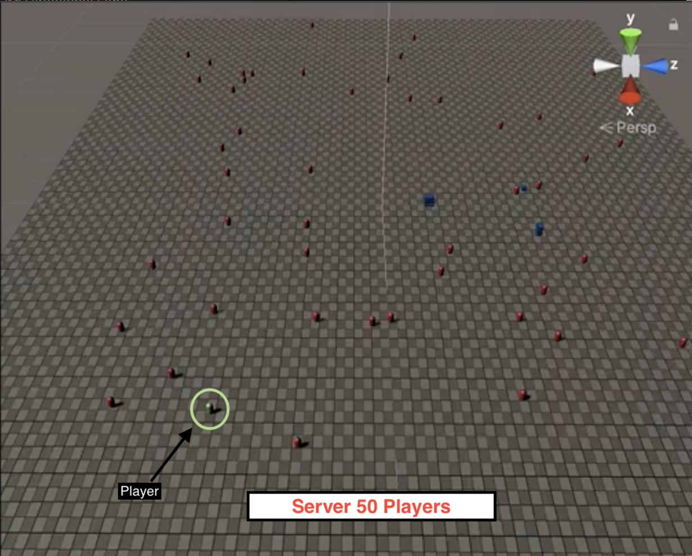
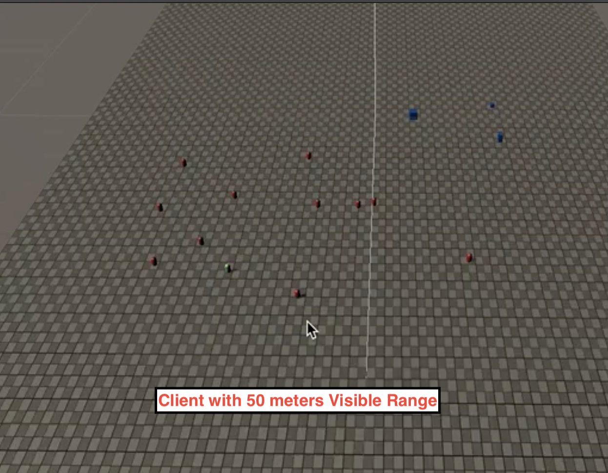

# MLAPI FPS Prototype

This is a prototype build to test features of MLAPI. The goal is to make a sampe to simualte upto 40-50 players FPS.   

 

Top left image shows server running 50 player. The right image shows client with 50 meters of visibility range

## Setting up number of players

* Go to GameScene and select GameNetworking in hierarchy
* In the inspector, you will see IVNetworkInitialise. 
* Change Server NPC Count

> Note that these NPC's are instantiated on Server side. I did this to easily simulate number of players. Otehr way could have been running those many instances which didn't seem that feasible.

## Running Server & Client Instances

It can be done in two ways.

1. Using Parrel Sync: In the menu bar choose ParrelSync option. It will open a poopup. Create a clone project. Its pretty straight forward. Basically It will create a new directory with simlinks to main project.
2. Make Mac / Windows build.

Once you have done this. Run the project. Choose "Start Server" on one instance and "Start Client" On other

## Work in Progress

* Getting LagCompensation to work. 
* Optimising Network Transform to use delta compression
* Integrating 3D character models and Animation
